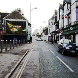
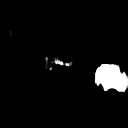
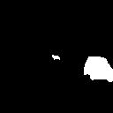
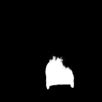
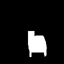
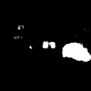
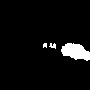

# keras-segnet-camvid
CamVid データセットを使用したSegNetによる自動車のセグメンテーションのテストです。

## 実行環境
* Tensorflow 1.12.0
* Keras 2.2.4
* OpenCV 3.4.2

## 実行方法
* ネットワークのトレーニング
    ```bash
    python train.py
    ```
    * 各エポックにおいて、ネットワークのパラメータが./temp/model-####.h5に保存されます。

* ネットワークのテスト
    ```bash
    python evaluate.py --model "./temp/model-####.h5"
    ```
    または
    ```bash
    python evaluate.py -m "./temp/model-####.h5"
    ```

## 実行結果
入力画像, セグメンテーション結果, (教師信号)

<!--  -->
<!--  -->
<!--  -->


<!--  -->
<!--  -->
<!--  -->


<!--  -->
<!--  -->
<!--  -->


